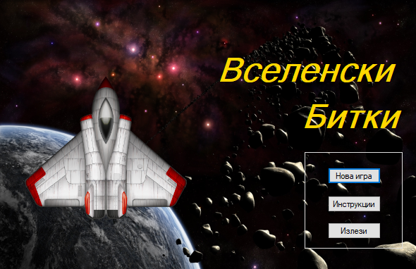
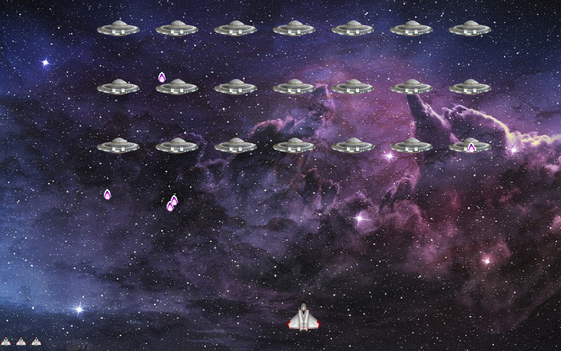
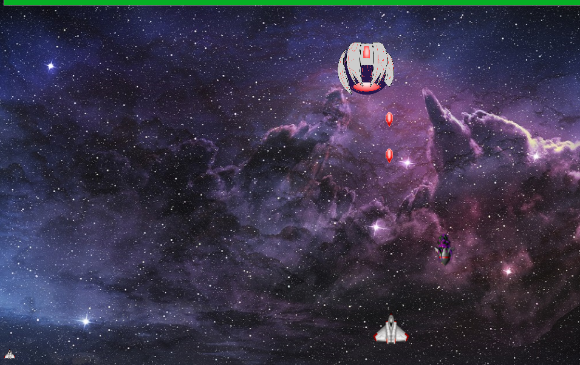
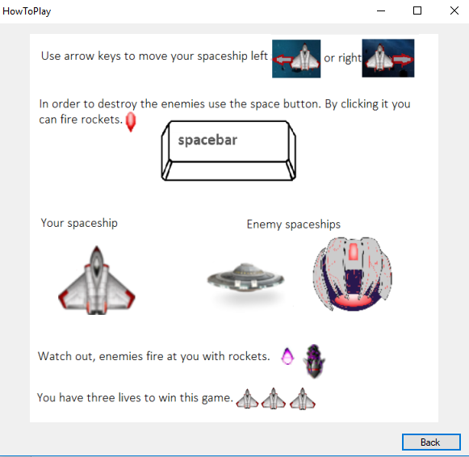

# VselenskiBitkiVP-Proekt# 
Замислата на нашиот проект е да се имплементира едноставна 2Д игра во стилот на легендарната Space Invaders. Настанот во играта се случува во вселената, каде едно малечко летало се бори со вонземските непријатели. Целта на играта е најпрво да се уништат сите мали вселенски летала на непријателот за потоа да се стигне до главниот непријател и истиот да се уништи.

 

Играта се состои од 5 класи и 3 форми. 	Класи: 
•	PlayerSpaceship.cs - за леталото со кое игра играчот 
•	EnemySpaceship.cs - за непријателските летала 
•	Boss.cs - за главниот непријател 
•	Weapon1.cs - за оружјето на леталото на играчот како и за оружјето на непријателските летала 
•	BossWeapon.cs - за оружјето на главниот непријател. 
	Форми: 
•	Home.cs - главна форма 
•	Form1.cs - играта 
•	HowToPlay.cs - правила на играта.

Да ја земеме на пример класата PlayerSpaceship.cs, сите променливи се прецизно дефинирани, односно нивните имиња се одбрани да одговараат на нивната намена. Оваа класа се состои од 9 функции. Во LoseLife() функцијата само се намалува бројот на животи на леталото. Move(int dx, int dy) се користи за придвижување на леталото по dx кое во главната функција е декларирано на -20 за лево и 20 за десно, dy=0. ChangePicture(Pictures p) се користи за менување на сликата кога се придвижува леталото. Draw(Graphics g) се користи за исцртување на сликите од леталото. Функциите AddWeapon1(), RemoveWeapon1(int i), MoveTheWeapon(int i) и getWeapon1(), се користат за првично поставување на ракетата откако ќе биде притиснато Space копчето, отстранување на сликата од ракетата откако ќе погоди некој непријател, за придвижување на ракетата, и за постаување листа од ракети соодветно. GetHit(Rectangle rec) функцијата се користи за испишување на пораката дека е изгубен живот откако леталото било погодено од страна на непријателот. 

Изглед на играта:
 
•	Почетно мени

•	Играта со првите непријатели.

•	Играта со Шефот

•	Упатството за играње

 

Правила на играта:
	Контролите на играта се едноставни, односно оваа игра се игра со три копчиња, Left Key, Right Key и Space. <b>Left Key</b> и <b>Right Key</b> се користат за придвижување на леталото лево и десно, додека <b>"Space"</b> копчето се користи за пукање на ракети и соодветно уништување на непријателите. Дополнително има опција да се зачува играта во било кое време со притиснувањето на буквата <b>"S"</b>(латинична поддршка) и истата повторно да се отвори во било кое време додека трае играта со притискање на буквата <b>"O"</b>(латинична поддршка). Играта се состои од две нивоa, и леталото има три животи. Најпрво во играта се појавуваат 21 непријателско летало кои се движат лево, десно и кои пукаат кон леталото на играчот. Играчот треба да ги уништи сите, но при тоа да внимава да не биде погоден. Кога ќе бидат уништени сите малечки летала се појавува главниот непријател. Животот на главниот непријател е претставен на прогрес бар на врвот на екранот. Важно е да се напомене дека во 2 ниво имате <b>1 живот</b> само. Главниот непријател исто така пука кон леталото со ракети. Кога вашето летало ќе го уништи, играта завршува.

